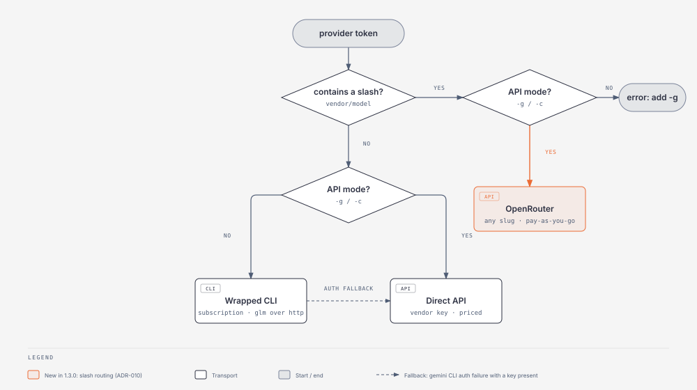
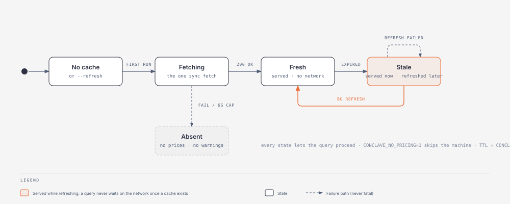
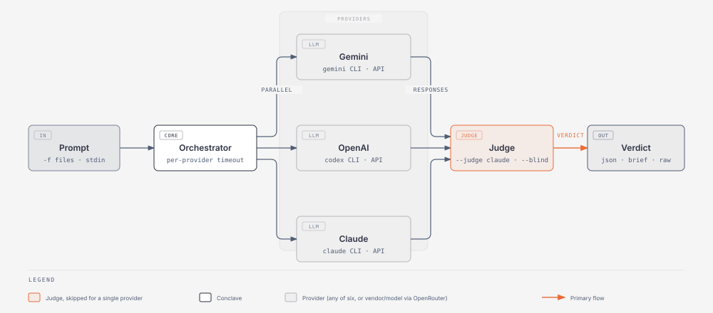
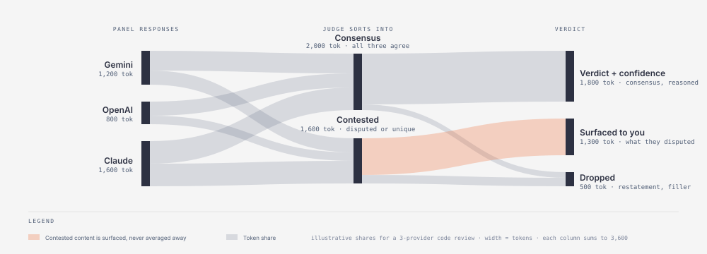

# Conclave

[](https://github.com/0xDarkMatter/conclave/releases)
[](LICENSE)
[](go.mod)
[](https://charm.sh)

> Stop juggling six AI CLIs. Query any model with one syntax, or convene the whole council and let a judge synthesize the verdict.

Tired of memorizing whether it's `--file` or `-f` or piping to stdin? Sick of context-switching between `gemini`, `claude`, `codex`, and whatever CLI Grok ships this week? **Conclave is your universal remote for LLMs** - one command, one syntax, any provider. Six direct providers, plus any model on OpenRouter by its `vendor/model` slug. Learn it once, query everything.

But here's where it gets interesting: why trust a single AI's opinion when you can convene an entire council? Conclave queries multiple models in parallel, then hands their responses to a judge who synthesizes a verdict with confidence levels, agreements, disagreements, and actionable recommendations. It's like having a room full of very expensive consultants who actually have to reach consensus before billing you.

Built with [Charm](https://charm.sh)'s Bubble Tea for a terminal UI that doesn't look like it crawled out of 1985. Animated spinners, real-time progress, token counts - because if you're going to burn API credits, you should at least enjoy watching the meter spin.

## Why Conclave?

- **One interface** - Same syntax for Gemini, Claude, GPT, Grok, Perplexity, GLM, and any `vendor/model` on OpenRouter
- **Reduce bias** - No single model's quirks dominate the response
- **Catch blind spots** - Disagreements are surfaced, not averaged away; different models notice different issues
- **Faster iteration** - Parallel queries, one synthesized answer, and an opt-in cache so re-runs are free
- **Know what it cost** - API-mode runs print the real dollar figure per response, from a daily-refreshed price catalog
- **Never run a dead model** - Conclave warns when a configured model id has vanished from the catalog
- **Beautiful TUI** - Animated progress with [Charm](https://charm.sh) (Bubble Tea)

## Recent Updates

### v1.3.0 — 2026-09-08

**🚀 Claude Opus 5 and GPT-5.6 Sol by default**

Defaults moved to the current flagships: claude `claude-opus-5`, openai `gpt-5.6-sol`, grok `grok-4.6`, glm `glm-5.3`, with `grok-build-0.1` and `glm-5.3-flash` in cheap mode. Every id was verified live on both the CLI and API routes before it shipped. Override any of them with `-m provider:model`.

**🌐 Any model via OpenRouter**

In API mode, write a provider as its OpenRouter slug and it just works: `conclave -g deepseek/deepseek-v4-pro,anthropic/claude-opus-5 "..." --judge openai/gpt-5.6-sol`. Slugs can sit beside direct providers on one panel or act as judge. Needs `OPENROUTER_API_KEY`; details in [docs/OPENROUTER.md](docs/OPENROUTER.md).

**💸 Costs you can see**

API-mode runs now print the dollar figure per response and in total, from a cached [OpenRouter](https://openrouter.ai/models) price catalog that refreshes once a day in the background. `--json` gains `cost_usd` and `meta.total_cost_usd`. `conclave models` prints current ids and prices; `conclave models --check` tells you if a compiled default has been retired.

**🗂 Opt-in response cache and a batch budget**

`--cache` reuses an identical provider response instead of paying for it twice; `--budget 5.00` stops a batch run once estimated spend hits the cap and leaves it resumable. Judge synthesis is never cached.

**🛠 gemini, codex and the hang that wasn't**

Google retired gemini-cli's free OAuth tier, so CLI-mode gemini now needs `GEMINI_API_KEY` and falls back to the direct API when the CLI's auth fails. codex is checked with `codex login status` instead of demanding an API key. And Conclave no longer opens an interactive setup prompt when stdin is not a terminal, which used to look like a 110-second hang from a script.

---

### v1.2.0 — 2026-06-18

**🚀 GPT-5.5 and GLM-5.2 support**

Conclave now defaults to the latest flagship models out of the box — OpenAI **GPT-5.5** and Z.ai **GLM-5.2**. Other defaults were refreshed too: gemini `gemini-3-pro-preview` (shut down) → `gemini-3.1-pro-preview`, claude → `claude-opus-4-8`, and grok's CLI default `grok-code-fast-1` (retiring 2026-08-15) → `grok-4-1-fast-reasoning`. Override any of them with `-m provider:model`.

**🔑 OS keyring for API keys**

Keys can now live in the OS keyring (Windows Credential Manager / macOS Keychain / Linux Secret Service) instead of a plaintext env var or `.env`. When a provider's `*_API_KEY` is unset, Conclave reads it from the keyring automatically — resolution order is env → `~/.config/conclave/.env` → `./.env` → keyring. Manage entries with the new `conclave keyring set|list|rm <ENV_VAR>` command.

```bash
conclave keyring set GLM_API_KEY      # hidden prompt; loads automatically thereafter
```

**🔌 GLM drops the `opencode` dependency**

CLI-mode `glm` no longer shells out to the `opencode` binary — it calls the Z.ai GLM Coding Plan directly over OpenAI-compatible HTTP (`api.z.ai/api/coding/paas/v4`), using your flat Coding Plan subscription. GLM now needs only an API key, like every other provider.

**📐 Architecture Decision Records**

Added [`docs/adr/`](docs/adr/) — eight ADRs capturing the foundational design (dual provider modes, LLM-as-judge, parallel/per-provider timeouts, the shared HTTP client, credential precedence) plus this release's decisions.

---

### v1.1.0 — 2026-05-22

**🐛 Production bug fixes**

Six fixes for pain points hit running Conclave heavily against gpt-5.x reasoning models. Most importantly: `conclave -g openai -m openai:gpt-5.5` now works — previously the call would silently fail or return empty responses because OpenAI rejects `max_tokens` for the reasoning model family and needs `max_completion_tokens` instead. Error visibility is dramatically improved across the board: HTTP status codes, provider error codes and params, and full diagnostic bodies are surfaced instead of truncated. When all providers fail, you now see each provider's full error in the styled output instead of just a clipped spinner line.

**✨ `--raw` output mode**

New flag emits sentinel-separated provider blocks for clean piping into downstream parsers. Implies `--no-judge`, mutually exclusive with `--json`.

```bash
conclave -g gemini,claude "classify" --raw -f items.txt | my-extractor
```

**🎨 Styled output with Lipgloss**

New header panel with metadata, adaptive colors for light/dark terminals, and a refreshed cool-tones palette. The output now actually looks like the tagline promises.

**🛡 Preflight auth checks**

Catches missing or invalid credentials before burning the parallel-query timeout. Bypass with `--skip-preflight`.

**👀 `--list-providers` shows both modes**

The CLI and API columns now print side-by-side by default. The surprising divergences (glm is CLI-only, grok uses different defaults per mode) are visible at a glance. Use `-g` to get the single-column format for scripts that parse this output.

---

### v1.0.0 — 2026-01-08

**🎉 Initial release**

Multi-provider parallel querying across Gemini, OpenAI, Claude, Grok, Perplexity, and GLM — in CLI mode (wrapping each provider's CLI) or API mode (`-g`). A judge model synthesizes the responses into a single verdict, with `--blind` for unbiased judging. Plus cheap mode (`-c`), batch mode (`--batch`) with parallel workers and resume, and a Charm Bubble Tea TUI with live progress.

---

## Terminal UI

Conclave features a rich terminal interface powered by [Bubble Tea](https://github.com/charmbracelet/bubbletea):

```
▸ Querying 3 providers...
  ├── ⠹ Google Gemini 3.1 Pro [02.34s]
  ├── ✓ OpenAI GPT-5.6 Sol [01.91s / 000168 tokens]
  └── ⠼ Anthropic Claude Opus 5 [03.12s]

▸ Crystallizing... ⠋ [02.45s]
```

- **Animated spinners** - Braille animation for active providers
- **Real-time progress** - Token counts and timing as providers complete
- **Synthesis verbs** - 25 rotating verbs during verdict synthesis
- **Non-TTY fallback** - Clean output for CI/CD and piped commands
- **Cost on the line** - In API mode each provider block and the footer carry the real spend

## One CLI, Every LLM

Beyond consensus, Conclave serves as a **unified interface for any LLM**. Instead of learning six different CLI tools with different syntaxes, flags, and quirks - use one:

```bash
# Same syntax, any provider
conclave gemini "Explain this error" -f error.log
conclave claude "Review this PR" -f diff.txt
conclave openai "Generate test cases" -f api.go
conclave grok "What does this regex do?" -f patterns.txt
```

**Why use Conclave for single-provider queries?**

| Benefit | Without Conclave | With Conclave |
|---------|-----------------|---------------|
| Syntax | Learn each CLI's flags | One consistent syntax |
| Files | Different `-f`/`--file`/stdin handling | Always `-f` |
| Setup | Configure each tool separately | `conclave init` once |
| Switching | Remember which tool for which task | Just change the provider name |
| Models | Different `--model` formats | Always `-m provider:model` |

```bash
# Quick single-provider queries (no judge needed)
conclave gemini "What's the time complexity of this?" -f algo.py
conclave perplexity "Latest news on Rust 2.0"
conclave -g claude "Summarize this paper" -f paper.pdf

# Switch models on the fly
conclave gemini "Explain" -m gemini:gemini-3.8-flash      # Fast
conclave gemini "Explain" -m gemini:gemini-3.1-pro-preview # Thorough
```

When you query a single provider, Conclave skips the judge phase and returns the response directly - it's just a cleaner interface to the underlying LLM.

## Installation

```bash
git clone https://github.com/0xDarkMatter/conclave
cd conclave
make install  # installs to ~/.local/bin
```

## Requirements

Conclave operates in two modes with different requirements:

### API Mode (`-g`) - Recommended for Most Users

**Only requires API keys** - no additional CLI tools needed.

```bash
conclave init                    # Set up API keys
conclave -g gemini,claude "..."  # Works immediately
```

### CLI Mode (Default)

Uses provider-specific CLI tools optimized for coding tasks. Each provider requires its CLI installed:

| Provider | CLI Tool | Installation |
|----------|----------|--------------|
| **gemini** | `gemini` | `npm install -g @google/gemini-cli`, plus `GEMINI_API_KEY` (Google retired the CLI's free OAuth tier; Conclave falls back to the API if the CLI's auth fails) |
| **claude** | `claude` | `npm install -g @anthropic-ai/claude-code`, then `claude auth login` (Max subscription, no API key) |
| **openai** | `codex` | `npm install -g @openai/codex`, then `codex login` (ChatGPT subscription, no API key) |
| **grok** | `grok` | See [xAI Grok CLI](https://github.com/xai-org/grok-cli) |
| **perplexity** | `perplexity` | See [Perplexity CLI](https://github.com/perplexity-ai/perplexity-cli) |
| **glm** | _(none — direct API)_ | Set `GLM_API_KEY` (GLM Coding Plan key from [z.ai](https://z.ai/manage-apikey/apikey-list)) |

**Check what's available:**

```bash
conclave --list-providers      # CLI mode - shows installed CLIs
conclave --list-providers -g   # API mode - shows configured API keys
```

**Tip:** Start with API mode (`-g`) to get running quickly. Add CLI tools later if you want their coding-specific optimizations, or to run on subscriptions instead of metered keys. You can mix the two per provider in one call: `gemini@api,openai@cli,claude@cli` (see [Modes](#modes)).

## Quick Start

```bash
# First run - interactive setup for API keys
conclave init

# Query multiple providers
conclave gemini,openai,claude "Is this code secure?" -f auth.go --judge claude

# Use all available providers
conclave --all "Review this architecture" -f design.md --judge claude
```

## Modes

Each provider token is routed by three questions: does it carry a `vendor/model` slug, does it
carry a `@cli` / `@api` suffix, and (only if it does not) is `-g` set?

<picture>
  <source media="(prefers-color-scheme: dark)" srcset="docs/diagrams/provider-routing-dark.svg">
  
</picture>

### CLI Mode (Default)

Uses coding-focused CLI tools (`gemini`, `claude`, `codex`, etc.). Best for code review and technical queries.

```bash
conclave gemini,claude "Explain this function" -f utils.go
```

### General Mode (`-g`)

Uses raw APIs without coding restrictions. Best for general-purpose queries, research, and non-technical topics.

```bash
conclave -g gemini,openai,claude "What are the implications of quantum computing for cryptography?" --judge claude
```

### Cheap Mode (`-c`)

Uses smaller, faster models for cost-effective batch processing and pipelines. Implies `-g` (API mode).

```bash
# ~10x cheaper per query
conclave -c gemini,claude "Classify as spam/ham" -f message.txt --json

# Batch processing with all providers
conclave -c --all "Summarize" -f doc.md --brief
```

**Cheap mode models:**

| Provider | Default Model | Cheap Model |
|----------|---------------|-------------|
| gemini | gemini-3.1-pro-preview | gemini-3-flash-preview |
| openai | gpt-5.6-sol | gpt-5-nano |
| claude | claude-opus-5 | claude-haiku-4-5 |
| perplexity | sonar-pro | sonar |
| grok | grok-4.6 | grok-build-0.1 |
| glm | glm-5.3 | glm-5.3-flash |

### Mixed transports (`<provider>@cli` / `<provider>@api`)

A token can pin its own transport. The suffix overrides `-g` / `-c` for that provider only;
bare tokens keep following the global mode, so every existing command line means what it
meant. This is how one panel runs gemini on a metered key (its CLI lost its free tier) beside
openai and claude on their ChatGPT Pro and Claude Max subscriptions:

```bash
# gemini on the API, openai and claude on their subscription CLIs, one panel, one JSON
conclave gemini@api,openai@cli,claude@cli "Grade this answer" --no-judge --json

# The judge and -m take the same grammar
conclave -g gemini,openai --judge claude@cli -m openai@cli:gpt-5.6-sol "Is this secure?"
```

Rules:

- **The provider's name stays bare everywhere**: progress line, judge label, and `--json`
  keys (`responses.openai`, never `responses["openai@cli"]`). `--json` gains
  `responses.<provider>.transport: "cli" | "api"` so a consumer can tell which leg ran where.
- **Dollars follow the transport, per response.** A `@cli` leg is subscription-billed and shows
  no cost field; it does not turn the total into a floor. Only API legs are priced.
- **`-m` applies by provider, not by spelling**: `-m openai:x` and `-m openai@cli:x` both set
  openai's model whichever transport it runs on.
- **`-c` implies API for bare tokens**, as before. A `@cli` provider under `-c` uses its
  normal CLI default model, because the cheap models are API ids the CLI wrappers cannot use.
- **`vendor/model` slugs are API-only** ([OpenRouter](docs/OPENROUTER.md)): `deepseek/x@cli`
  is an error that says why; `deepseek/x@api` works without `-g`.
- **`glm@api` is refused** (API mode is disabled for glm, ADR-006); use `glm` or `glm@cli`.
- **`--all` is unchanged** and takes its list from the global mode.
- **A standing choice goes in the config file.** `transports: {gemini: api, claude: cli}` in
  `config.yaml` (or `CONCLAVE_CLAUDE_TRANSPORT=cli`) pins bare tokens without retyping the
  suffix. Precedence is suffix, then config, then `-g` / `-c`. A value other than `cli` or `api`
  fails the run naming the key.
- **Mixed panels say so in the styled view.** When a panel runs on more than one transport,
  each provider block is tagged `via cli` or `via api`. Single-transport runs are unchanged.
- **One provider, one seat.** `claude@cli,claude@api` is refused: outputs are keyed by the
  bare name, so the two legs would overwrite each other. Run them as two panels if you need both.
- **The judge is checked on its own transport.** With `-g gemini,claude@cli --judge claude`
  the judge is the API claude, a different credential from the panel's CLI claude, and is
  preflighted separately.

The API-mode warning about an idle subscription now suggests the suffix: `write openai@cli to
run it on the plan in this panel`. Decision record: [ADR-012](docs/adr/ADR-012-per-provider-transport-suffix.md).

### Batch Mode (`--batch`)

Process thousands of items with parallel workers, rate limiting, and resume capability. Built in Go for performant concurrent execution - scales to 200 parallel workers with minimal overhead. Uses cheap mode by default.

```bash
# Process a JSONL file with a single provider
conclave -c grok "Classify this account" --batch items.jsonl -o results.jsonl

# Parallel workers for faster throughput
conclave -c gemini "Analyze" --batch items.jsonl --workers 50 -o results.jsonl

# Cap the spend; the run exits non-zero and --resume continues it
conclave --all --batch items.jsonl -o out.jsonl --budget 5.00 --resume

# Resume an interrupted job
conclave -c claude "Analyze" --batch items.jsonl -o results.jsonl --resume
```

**Input format (JSONL):**
```jsonl
{"id": "1", "context": "Username: @acme_corp\nBio: Enterprise solutions...\nFollowers: 50K\n\nRecent posts:\n..."}
{"id": "2", "context": "Username: @jane_dev\nBio: Software engineer, coffee lover\nFollowers: 2K\n\nRecent posts:\n..."}
```

**Performance (99 items, 50 workers, measured December 2025 on the cheap models of the time; costs have moved since, see the caveat in [docs/BATCH_BENCHMARKS.md](docs/BATCH_BENCHMARKS.md)):**

| Provider | Time | Cost | Best For |
|----------|------|------|----------|
| **Grok** | 23s | $0.05 | Speed & cost efficiency |
| Gemini | 33s | $0.28 | Budget with decent quality |
| Claude | 39s | $0.65 | Accuracy, depth, nuanced analysis |
| OpenAI | 88s | $0.18 | Reliable fallback |

**Note:** Complex prompts slow throughput by 1.4-2.3x. Claude produces the most comprehensive analysis but at higher cost.

See [docs/BATCH_MODE.md](docs/BATCH_MODE.md) for full documentation and [docs/BATCH_BENCHMARKS.md](docs/BATCH_BENCHMARKS.md) for detailed performance benchmarks.

## Providers

| Provider | CLI Mode | API Mode (`-g`) | Env Variable |
|----------|----------|-----------------|--------------|
| gemini | `gemini` CLI | Gemini API | `GEMINI_API_KEY` |
| openai | `codex` CLI | OpenAI API | `OPENAI_API_KEY` |
| claude | `claude` CLI | Anthropic API | `ANTHROPIC_API_KEY` |
| perplexity | `perplexity` CLI | Perplexity API | `PERPLEXITY_API_KEY` |
| grok | `grok` CLI | xAI API | `XAI_API_KEY` |
| glm | Coding Plan API (direct HTTP) | Zhipu API | `GLM_API_KEY` / `ZAI_API_KEY` |
| `vendor/model` | — | OpenRouter (any model) | `OPENROUTER_API_KEY` |

### Default Models

| Provider | CLI Mode | API Mode |
|----------|----------|----------|
| gemini | gemini-3.1-pro-preview | gemini-3.1-pro-preview |
| openai | gpt-5.6-sol | gpt-5.6-sol |
| claude | claude-opus-5 | claude-opus-5 |
| perplexity | sonar-pro | sonar-pro |
| grok | grok-4.6 | grok-4.6 |

Override with `-m provider:model`:
```bash
conclave gemini,claude "Review this" -m gemini:gemini-2.5-flash -m claude:sonnet
```

### OpenRouter (any model)

In API mode, any provider token written as an OpenRouter slug (`vendor/model`) is sent
through [OpenRouter](https://openrouter.ai/models). The slug is both the provider name and
the model id, so several OpenRouter models can sit on one panel or act as judge:

```bash
conclave -g deepseek/deepseek-v4-pro,anthropic/claude-opus-5 "Compare these" --judge openai/gpt-5.6-sol
conclave -g google/gemini-3.8-flash,claude "Summarise" --judge claude   # mix with direct providers
```

Set `OPENROUTER_API_KEY` (env, `.env`, or `conclave keyring set OPENROUTER_API_KEY`).
`conclave models` prints current slugs and prices; `--list-providers -g` shows whether the key
is configured. `--all` never auto-includes OpenRouter models. A slug the catalog does not list
still runs (with a warning) as a panel member, but is refused as the judge so a typo cannot cost
you the whole panel; `--skip-preflight` overrides that.

- **API mode only, pay-as-you-go.** OpenRouter cannot use subscriptions (Claude Max, Codex,
  GLM Coding Plan), and it adds a platform fee of about 5% over the vendor's list price. In CLI
  mode a slash token is rejected with a hint to add `-g`.
- **Direct providers remain better for gemini, openai and claude**: no fee, provider-specific
  request fields, and subscription billing in CLI mode. Use OpenRouter for models conclave has
  no direct provider for. Full guide (setup, finding slugs, costs, the judge rule, error decoder):
  [docs/OPENROUTER.md](docs/OPENROUTER.md); rationale in [ADR-010](docs/adr/ADR-010-openrouter-as-a-slash-routed-api-backend.md).

## Setup

### Interactive Setup

```bash
conclave init
```

Walks you through configuring API keys, validates each one, and saves to `~/.config/conclave/.env`. Keys load automatically on subsequent runs.

### Manual Setup

Set environment variables directly:
```bash
export GEMINI_API_KEY=your-key
export OPENAI_API_KEY=your-key
export ANTHROPIC_API_KEY=your-key
```

Or create `~/.config/conclave/.env`:
```bash
GEMINI_API_KEY=your-key
OPENAI_API_KEY=your-key
ANTHROPIC_API_KEY=your-key
```

### OS Keyring (no plaintext)

Store keys in the OS keyring (Windows Credential Manager / macOS Keychain / Linux
Secret Service) instead of a file. When the matching env var is unset, conclave
reads the key from the keyring automatically:

```bash
conclave keyring set GLM_API_KEY      # hidden prompt, or: echo "$KEY" | conclave keyring set GLM_API_KEY
conclave keyring list                 # show which provider keys are stored
conclave keyring rm  GLM_API_KEY
```

Resolution order is environment variable → `~/.config/conclave/.env` → `./.env` →
OS keyring. See [ADR-008](docs/adr/ADR-008-api-keys-resolve-from-environment-then-os-keyring.md).

### Check Available Providers

```bash
# CLI mode
conclave --list-providers

# API mode
conclave --list-providers -g
```

### Model Catalog and Prices

Conclave keeps a cached copy of the [OpenRouter](https://openrouter.ai/models) model feed
(refreshed in the background once a day) and uses it to warn you when a configured model
id has disappeared, to price batch-mode cost estimates, and to answer "what exists and
what does it cost" without leaving the terminal:

```bash
conclave models                 # every provider, newest models first
conclave models claude          # one provider
conclave models --check         # do the compiled defaults still exist? exit 2 on drift
conclave models --refresh       # fetch now instead of waiting for the daily refresh
```

Prices shown are pay-as-you-go API prices and apply to API mode (`-g`, `-c`, `--batch`).
CLI mode runs on each provider's subscription and costs nothing per token. Set
`CONCLAVE_NO_PRICING=1` to disable the catalog entirely, or `CONCLAVE_PRICING_TTL=<hours>`
to change how often it refreshes. `--check` exits 2 on drift and 3 when the catalog is
unreachable, so a release script can tell the two apart. See
[docs/MODEL_REGISTRY.md](docs/MODEL_REGISTRY.md) for the annotated reference.

The catalog never blocks a query: once a cache exists it is served immediately, stale or
not, and refreshed in the background.

<picture>
  <source media="(prefers-color-scheme: dark)" srcset="docs/diagrams/pricing-catalog-dark.svg">
  
</picture>

## Usage Examples

### Code Review

```bash
# Review a file
conclave gemini,claude,openai "Review for bugs and security issues" -f api.go --judge claude

# Compare implementations
conclave gemini,claude "Which approach is better?" -f impl_a.go -f impl_b.go --judge claude

# Pipe from stdin
git diff HEAD~1 | conclave gemini,claude "Review these changes" --judge claude
```

### Research & Analysis

```bash
# General knowledge (API mode)
conclave -g --all "Explain the trolley problem and its variations" --judge claude

# Fact-checking
conclave -g gemini,perplexity,claude "Is it true that..." --judge claude
```

### Architecture Decisions

```bash
conclave --all "Should we use microservices or monolith for this use case?" \
  -f requirements.md --judge claude --verbose
```

## Output Formats

### Human-Readable (Default)

Shows verdict, confidence, reasoning, agreements, disagreements, and recommendations in a formatted display.

### JSON (`--json`)

```bash
conclave gemini,claude "Analyze" --judge claude --json | jq '.verdict'
```

Structured output for scripting and CI/CD integration.

### Cost Fields (API transport only)

Conclave prices each response that ran on the API (`-g` / `-c`, or a
`<provider>@api` token) from the cached OpenRouter catalog and shows the dollar
figure on the provider block, in the header panel, and in the `Completed in`
footer. `--json` carries the same numbers as `responses.<provider>.cost_usd`
and `meta.total_cost_usd` (providers plus judge), and says which leg ran where
in `responses.<provider>.transport`.

Three rules govern the numbers:

- **A CLI leg shows nothing about dollars.** Those providers ride subscriptions
  (Claude Max, Codex, the GLM Coding Plan), so a per-token price would be fiction.
  In a mixed panel (`gemini@api,claude@cli`) only the API leg carries a figure,
  and the CLI leg does not mark the total as understated.
- **An unknown price is omitted, never printed as `$0.00`.** If the catalog is
  offline, disabled with `CONCLAVE_NO_PRICING=1`, or simply does not list the
  model, the field is absent. A displayed zero always means a real zero.
- **A total ending in `+` is a floor.** At least one response could not be
  priced, so the true spend is higher than shown.

`--raw` and `--brief` are unchanged: both are fixed-shape contracts.

### Response cache (`--cache`)

Off by default. `--cache` reuses an identical provider response instead of
paying for it twice, which makes iterating on a prompt, a judge choice, or an
output format free.

```bash
conclave -g gemini,openai "Review this" -f auth.go --cache        # 24h TTL
conclave -g gemini,openai "Review this" -f auth.go --cache=6h     # explicit TTL
CONCLAVE_CACHE_TTL=6 conclave -g gemini,openai "Review this"      # via env, in hours
conclave -g gemini,openai "Review this" --no-cache                # override the env
```

An explicit TTL must use `--cache=6h`, not `--cache 6h`.

An entry is addressed by the mode, provider, model and the **full prompt
including any file or stdin context**, so changing one byte of an attached file
is a miss. A hit is marked `(cached)` on the progress line and the provider
block, carries `cached: true` in `--json`, and costs nothing. Failures are never
cached, and **judge synthesis is never cached** because a verdict depends on the
whole set of responses it saw. See ADR-011.

Works in both CLI and API mode, and batch mode honours it per item.

```bash
conclave cache stats   # directory, entry count, size, age range
conclave cache clear   # delete every cached response
```

Entries are plain JSON under `$XDG_CACHE_HOME/conclave/responses/`. Leave the
cache off for anything sensitive.

### Brief (`--brief`)

One-line summary: verdict, confidence, and key recommendation.

### Quiet (`-q`)

Verdict only - for scripts that just need the answer.

### Raw (`--raw`)

Sentinel-separated provider blocks only - no header art, no judge, no styling. For piping into downstream parsers.

```bash
conclave -g gemini,openai "Classify" --raw -f items.txt | my-extractor
```

Format:
```
===PROVIDER:openai MODEL:gpt-5.6-sol STATUS:success===
<response body>
===PROVIDER:claude MODEL:claude-opus-5 STATUS:error===
<error message>
===END===
```

Implies `--no-judge`.

## Flags Reference

```
Query Flags:
  -f, --file <path>      Include file content (repeatable)
  -j, --judge <provider> LLM that synthesizes verdict (default: claude)
      --no-judge         Skip synthesis, return raw responses
  -t, --timeout <secs>   Per-provider timeout (default: 60)
  -m, --model <p:model>  Override model for provider (p@cli:model / p@api:model also accepted)

Mode Flags:
  -g, --general          Use API mode (no coding restrictions)
  -c, --cheap            Cheap mode: smaller/faster models, implies -g
  <provider>@cli|@api    Per-token transport, overrides -g/-c for that provider only
                         (works in the provider list, --judge and -m; see Modes)
  -a, --all              Query all available providers
      --blind            Anonymize providers for unbiased judging

Batch Mode:
      --batch <file>     JSONL input file for batch processing
      --workers <n>      Number of parallel workers (default: 5)
  -o, --output <file>    Output file (default: stdout)
      --resume           Resume from checkpoint, skip processed items
      --retries <n>      Retry failed batch items N times with exponential backoff (batch mode only)
      --no-rate-limit    Disable rate limiting (high-tier API accounts)
      --budget <usd>     Stop dispatching once estimated spend hits this cap (also CONCLAVE_BATCH_BUDGET)

Cache Flags:
      --cache[=TTL]      Reuse identical provider responses (default 24h; also CONCLAVE_CACHE_TTL=<hours>)
      --no-cache         Never read or write the response cache

Output Flags:
      --json             Structured JSON output
      --verbose          Include full provider responses
      --brief            Short verdict only
  -q, --quiet            Minimal output (verdict only)
      --raw              Sentinel-separated provider blocks only (implies --no-judge)

Subcommands:
      conclave models    Inspect the model/price catalog
      conclave keyring   Manage API keys in the OS keyring
      conclave cache     Inspect or empty the response cache

Other:
      --list-providers   List available providers and exit
      --version          Show version
```

## Features

### Parallel Execution

All providers are queried simultaneously. Total time ≈ slowest provider, not sum of all.

### Automatic Retry

Transient failures (429 rate limits, 5xx errors) automatically retry with exponential backoff:
- Up to 3 retries
- 1s → 2s → 4s delays with jitter
- Respects `Retry-After` headers

This is built-in for **all** single-call queries via API mode. The `--retries` flag is separate and applies only to **batch mode** (`--batch`) — it retries failed items in the JSONL pipeline. 400-class errors (auth, bad params) never retry in either path since they won't fix themselves.

### Blind Mode

Anonymize provider names so the judge evaluates responses without brand bias:

```bash
conclave --all "Which solution is best?" -f options.md --judge claude --blind
```

The judge sees "Provider A", "Provider B", etc. instead of "OpenAI", "Claude".

### Context Handling

- Automatic stdin detection for piped content
- Multiple `-f` flags for comparing files
- Configurable context size limits

## Configuration

### Config File

`~/.config/conclave/config.yaml`:

```yaml
default_judge: claude
timeout_seconds: 60

models:
  gemini: gemini-3.1-pro-preview
  openai: gpt-5.6-sol
  claude: claude-opus-5

# Pin a provider's transport for bare tokens (optional; ADR-012).
# A token's own @cli/@api suffix still wins; -g/-c applies to the rest.
transports:
  gemini: api
  claude: cli

# Override cheap mode models (optional)
cheap_models:
  gemini: gemini-3.1-flash-lite # Cheaper than the default cheap model
  claude: claude-sonnet-5       # Balance speed/quality
```

### Environment Variables

```bash
CONCLAVE_TIMEOUT=30               # Override timeout
CONCLAVE_GEMINI_MODEL=...         # Override default model
CONCLAVE_CHEAP_CLAUDE_MODEL=...   # Override cheap mode model
CONCLAVE_EXCLUDE=glm,grok         # Exclude providers from --all
CONCLAVE_PRICING_TTL=24           # Hours between OpenRouter catalog refreshes
CONCLAVE_NO_PRICING=1             # Disable the catalog (no network, no drift warnings)
```

## How It Works

<picture>
  <source media="(prefers-color-scheme: dark)" srcset="docs/diagrams/how-it-works-dark.svg">
  
</picture>

1. **Query Phase** - Prompt sent to all providers in parallel, each under its own timeout
2. **Judge Phase** - Designated LLM synthesizes the responses (skipped for a single provider)
3. **Output Phase** - Formatted result with confidence and reasoning, priced in API mode

### Multi-model judging

The judge does not average the panel. It sorts what the models said into what they agree
on and what they contest, turns the consensus into a reasoned verdict, and surfaces the
contested material as disagreements and blind spots rather than discarding it. `--blind`
hides which model said what so the sorting cannot favour a brand.

<picture>
  <source media="(prefers-color-scheme: dark)" srcset="docs/diagrams/judging-flow-dark.svg">
  
</picture>

Diagram sources live in [`docs/diagrams/src/`](docs/diagrams/src/); `python docs/diagrams/export.py` regenerates the light and dark SVGs.

## Use Cases

### Single Provider (Unified Interface)

- **Quick queries** - Ask any LLM with consistent syntax
- **Model comparison** - Same prompt, different providers, see which you prefer
- **Specialized tasks** - Perplexity for search, Claude for code, Grok for X context

### Multi-Provider (Consensus)

- **Code Review** - Multiple perspectives on security, quality, performance
- **Fact-Checking** - Cross-reference claims across models
- **Architecture Decisions** - Consensus on design trade-offs
- **Research Synthesis** - Combine knowledge from multiple sources
- **Risk Assessment** - Identify blind spots in analysis

## Using Conclave from agents and scripts

`--json` is the contract for callers: additive fields only, `status` is always `"success"` or
`"error"` per provider (a cache hit stays `"success"` and adds `cached: true`),
`responses.<provider>` is keyed by the bare provider name even when the token carried
`@cli` / `@api`, `responses.<provider>.transport` is present on every leg including CLI ones
(only `cost_usd` is API-only), so it is the field to read for vendor provenance, and
`execution.timeout_seconds` reports the real `-t`. Pair `--no-judge` with your own
aggregation when you want a majority vote across runs, and `--raw` when you want the
bodies with no parsing at all. Nothing is ever prompted for when stdin is not a terminal.

## Architecture Decisions

Key design decisions are recorded as ADRs in [`docs/adr/`](docs/adr/) — dual provider
modes, the LLM-as-judge synthesis, parallel/per-provider timeouts, the shared HTTP
client, credential precedence + OS-keyring fallback, the GLM Coding Plan transport, the
runtime pricing catalog, OpenRouter slash routing, the opt-in response cache, and the
per-provider `@cli` / `@api` transport suffix.

## License

MIT
