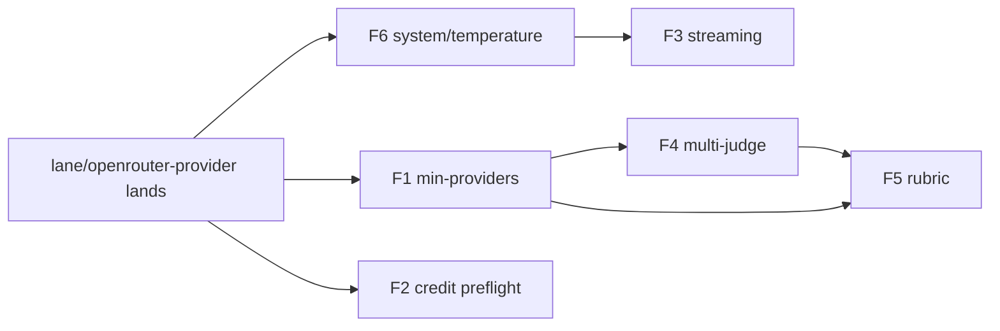

# Plan: reliability and judge-quality features

> Six decided features, planned not built. Branch `lane/plan-reliability-judging`,
> 2026-09-08. Assumes `lane/openrouter-provider` (ADR-010, slash-routed tokens)
> lands first; nothing here conflicts with its diff and several items reuse it.

## Goals

Make a Conclave run trustworthy when part of the panel fails, cheap to abort when a
key is dead, pleasant to watch for one provider, and rigorous enough as a judge that
Praxis (the main caller, `X:\Forge\Praxis\.claude\skills\praxis-grade\scripts\grade.py`)
can delete its own panel-health accounting, per-criterion majority, and prompt
plumbing. Every existing flag and output shape is unchanged unless a new flag is
passed; new JSON fields are additive.

## Non-goals

No new providers, no change to default models, no change to ADR-002's two-mode split,
no OpenRouter routing beyond ADR-010, no xAI-specific work Praxis would depend on
(grok is excluded from Praxis by operator preference), and no edits to Praxis itself.
Batch mode gets the new flags threaded through but no new batch-only behaviour.

## How the caller uses Conclave today

Praxis runs one call per question: `conclave gemini,openai "<instruction>" --no-judge
--json --general --timeout 180` with the evaluator prompt on stdin. Claude's vote goes
around Conclave through `claude -p` on the Max plan (the Anthropic key has no credit).
Praxis then parses each provider's JSON with a tolerant extractor, computes a
per-criterion majority (red-flag ties resolve to `indeterminate`, never `triggered`),
records `panel: {requested, responded, degraded, errors}` per question, and exits 3 on
any degraded question. It relies on Conclave printing the JSON envelope even on exit 1.
Two facts shape features 4 and 5: Praxis's "judges" are Conclave's *providers*, and one
panel member lives outside Conclave's process.

---

## Feature 1: partial-panel success (`--min-providers N`)

**Surface.** `--min-providers N` (default 1, which is today's behaviour: proceed with
any success, fail only when all fail). `--fail-degraded` makes a degraded-but-quorate
run exit 3. Config: `min_providers`, `fail_degraded`.

Every format carries the panel state:

```json
"panel": {"requested": 3, "succeeded": 2, "min": 2, "degraded": true,
          "failed": [{"provider": "gemini", "error": "HTTP 400: User location is not supported"}]}
```

Human and verbose: header row `Panel: 2/3 responded (degraded)` plus the existing
per-provider error boxes. Brief: verdict line gets a ` [panel 2/3]` suffix only when
degraded. Raw: one leading line `===PANEL requested=3 succeeded=2 degraded=true===`
emitted only when degraded; consumers splitting on `===PROVIDER:` are unaffected.

**Exit codes.** 0 full or quorate; 1 below quorum or all failed (envelope still
printed, as today); 3 quorate-but-degraded only under `--fail-degraded`. Distinct from
1 so a caller can tell "the answer is bad" from "the measurement is untrustworthy",
mirroring Praxis's own `_EXIT_DEGRADED = 3`.

**Design.** `orchestrator.Run` returns a `Panel` summary alongside responses and takes
`MinProviders`; the "all providers failed" error becomes a typed `ErrBelowQuorum`.
`output.Result` gains `Panel`; `renderJSON` adds the block unconditionally (additive,
version stays `1.0`). The judge receives only successful responses plus the panel
summary, so it stops seeing `[Error: ...]` pseudo-analyses unless `--verbose-judge`
(not planned) asks for them.

**Files.** `internal/orchestrator/orchestrator.go`, `internal/output/{output,render,
templates.go,templates/*.md}`, `internal/judge/prompt.go` (drop error blocks),
`cmd/root.go`, `internal/batch/processor.go` (per-item `panel` field).

**Edge cases.** `--min-providers` greater than the panel size is a usage error.
Single-provider runs never report degraded. Judge-only failure is not a panel failure
(see feature 4). Batch mode records `panel` per item and never retries a quorate run.

**Tests.** `panel-quorum-below-min.test` (2/4 with min 3 exits 1, envelope printed),
`panel-degraded-flag-in-every-format.test`, `panel-full-success-byte-identical.test`
(golden: 3/3 output unchanged apart from the additive JSON block),
`panel-raw-no-header-when-healthy.test`, `panel-fail-degraded-exit-3.test`.

**Docs/ADR.** New ADR (quorum contract). README flag table, AGENTS gotcha 2 (timeouts)
gains a line on quorum. Effort: 6 h.

## Feature 2: credit-aware preflight (API mode)

**Surface.** No new flag; `--skip-preflight` still bypasses. Config `preflight:
{credit: true}`. Failures print the existing remediation block with a new reason
column: `invalid_key`, `no_credit`, `forbidden`.

**What each vendor exposes** (verified against live docs 2026-09-08 with WebFetch):

| Vendor | Cheapest call | Reveals | Not revealed |
|---|---|---|---|
| Anthropic | `GET /v1/models` (`x-api-key`, `anthropic-version`) | key valid (401 `authentication_error`), 402 `billing_error`, 403 `permission_error` | credit balance; "credit balance too low" is a 400 only on `/v1/messages` |
| OpenAI | `GET /v1/models` (Bearer) | key valid (401) | quota; `credit_balance_exhausted` / `insufficient_quota` arrive as 429 on completions only |
| Gemini | `GET /v1beta/models?key=` | 401 `authentication`, 403 `permission_denied` | quota (429 `quota_exceeded` and 400 `failed_precondition` billing/location only on generate) |
| OpenRouter | `GET /api/v1/key` (Bearer) | `limit`, `limit_remaining` (null = unlimited), `usage`, `is_free_tier` | account balance; `/api/v1/credits` needs a management key, do not use |
| xAI | not documented on fetchable pages | unverified. Historically `GET /v1/api-key` returned `api_key_blocked`, `api_key_disabled`, `team_blocked`; must be confirmed live before use | balance |

Note the OpenRouter lane calls `/api/v1/auth/key`; the current docs name `/api/v1/key`.
Both must be probed live in the first implementation session and one kept.

**Mapping to outcomes.** `ok` (2xx), `fail` (401 or 403, OpenRouter `limit_remaining <= 0`,
xAI `api_key_blocked`/`disabled` if confirmed), `unknown` (timeout, 5xx, 429, transport
error). Only `fail` stops the run. Preflight stays a fast-fail helper on the shared 5 s
budget; a vendor that cannot answer in time is `unknown` and the query proceeds.

**Design.** `PreflightResult` gains `Reason string` and `Indeterminate bool`.
`apiBaseProvider` gets `preflightGET(ctx, url, headers) (status int, body []byte, err)`
with no retries (retries would eat the 5 s budget). Each API provider implements
`Preflight`; CLI providers keep their current checks. `cmd/init.go`'s
`validateAPIKey` reuses the same method instead of a paid query where possible.

**Files.** `internal/providers/{preflight.go,api_base.go,api_anthropic.go,api_openai.go,
api_gemini.go,api_grok.go,api_perplexity.go,api_openrouter.go}`, `cmd/init.go`.

**Edge cases.** Multi-key rotators: check the first key only, note it in the message.
Corporate proxies that 403 the models endpoint: `forbidden` is a fail; document
`--skip-preflight`. Gemini location blocks are invisible to preflight; feature 1 is
what surfaces them.

**Tests.** `preflight-no-credit-blocks-run.test` (httptest OpenRouter with
`limit_remaining: 0`), `preflight-unknown-never-gates.test` (5xx and slow server pass),
`preflight-invalid-key-reason.test`, `preflight-budget-5s-shared.test`.

**Docs/ADR.** Extends ADR-004 consequences (transport reuse); no new ADR. README
"Preflight" subsection. Effort: 6 h plus 1 h live probing.

## Feature 3: streaming

**Surface.** `--stream` (opt-in in v1; config `stream: off|on|auto`, `auto` = on when
exactly one provider, no judge, stdout is a TTY). Never active under `--json`, `--raw`,
`--quiet`, `--brief`, or batch; those paths do not call the streaming method at all,
so their bytes are identical by construction.

**Providers.** New optional interface:

```go
type Streamer interface {
    QueryStream(ctx context.Context, prompt, model string, opts QueryOptions,
                onDelta func(text string)) (string, time.Duration, *Metrics, error)
}
```

`api_base.go` gains `doStreamRequest` (SSE line reader, `data:` frames, `[DONE]`).
OpenAI-compatible providers (openai, grok, perplexity, glm, openrouter) send
`stream: true` plus `stream_options: {"include_usage": true}` where accepted (OpenAI,
OpenRouter, xAI; GLM and Perplexity must be probed and fall back to no metrics).
Anthropic: `stream: true`, `content_block_delta.text_delta`, usage from
`message_delta`. Gemini: `:streamGenerateContent?alt=sse`. Retries apply only before
the first delta; after that an error is surfaced with the partial text kept.

CLI mode: claude `--output-format stream-json --include-partial-messages --verbose`;
gemini `-o stream-json`; grok `-p --output-format streaming-json`. codex `--json` emits
JSONL events but partial text deltas were not verified, so codex is non-streaming
until a session confirms otherwise. Perplexity CLI is not installed here; unknown.
Providers without `Streamer` fall back to `Query` transparently.

**TUI.** In stream mode the Bubble Tea program is not started; a one-line stderr
header is printed, deltas go to stdout, and the styled footer follows. Optional phase
2: per-provider live preview in the multi-provider TUI via a throttled
`ProviderDeltaMsg` (10 Hz, last line only), which needs `--stream` plus a TTY and never
changes stdout.

**Files.** `internal/providers/{provider.go,api_base.go,api_*.go,claude.go,gemini.go,
grok.go}`, `internal/tui/{tui.go,model.go,msgs.go}`, `cmd/root.go`, `internal/output`
(footer-only render path).

**Tests.** `stream-json-byte-identical.test` (same fake provider, `--json` output equal
with and without `--stream`), `stream-sse-parser-split-frames.test` (frames split across
reads), `stream-fallback-non-streamer.test`, `stream-error-after-first-delta-keeps-text.test`,
`stream-never-under-raw.test`.

**Docs/ADR.** No ADR; the "machine formats never stream" invariant lives as a guard
comment in `cmd/root.go` and the golden test. README section. Effort: 10 h (API), 4 h
(CLI), 4 h (TUI preview, optional).

## Feature 4: multi-judge panels (`--judge claude,openai,gemini`)

**Surface.** `--judge` accepts a comma list; a single name is byte-identical to today.
`--min-judges N` (default 1). Output adds:

```json
"verdict": {"result": "UNSAFE", "confidence": "high", "reasoning": "...", "agreements": [], "disagreements": [], "recommendations": []},
"judges": [
  {"provider": "claude", "model": "claude-opus-5", "status": "success", "verdict": {"result": "UNSAFE", "confidence": "high", "reasoning": "..."}},
  {"provider": "openai", "model": "gpt-5.6-sol", "status": "success", "verdict": {"result": "UNSAFE", "confidence": "medium", "reasoning": "..."}},
  {"provider": "gemini", "model": "gemini-3.1-pro-preview", "status": "error", "error": "HTTP 429 ..."}
],
"agreement": {"metric": "verdict_string", "score": 1.0, "majority": "UNSAFE", "votes": {"UNSAFE": 2}, "succeeded": 2, "requested": 3, "degraded": true}
```

With several judges `verdict` is the *majority* verdict: `result` is the plurality of
normalised result strings (upper-case, trimmed), or `SPLIT` on a tie; `confidence` is
the lowest confidence among the majority; reasoning and lists come from the first
majority judge in `--judge` order. Judges run in parallel with the same prompt.

**Agreement metric.** Chosen: verdict-string agreement, `score = majority votes /
succeeded judges`. It is explainable, matches what Praxis already computes, and does
not trust a judge's self-reported confidence. Recorded alternative:
confidence-weighted agreement (high 1.0, medium 0.6, low 0.3, normalised), rejected
because self-reported confidence is uncalibrated across vendors and would let one
"high" judge outvote two "medium" ones.

**Blind mode.** One anonymised prompt is built once and sent to every judge, so labels
are identical across judges and per-judge verdicts are comparable. A judge that is
also a panel member is allowed as today; blind mode keeps it from recognising itself
by name (ADR-001 unchanged).

**Failure interaction.** Judge failures are not panel failures. Succeeded judges below
`--min-judges` sets `agreement.degraded`; exit follows the feature 1 policy (0 unless
`--fail-degraded`). A judge `PARSE_ERROR` counts as failed for the vote but keeps its
raw text under `judges[i].raw` (the existing PARSE_ERROR path is preserved per judge).
Today a judge error is swallowed: `runConclave` records it only in the spinner and
renders with no verdict and exit 0; the `judges` block fixes that silently-missing
verdict for the single-judge case too.

**Files.** `internal/judge/{judge.go,panel.go (new),prompt.go}`, `internal/output/*`,
`internal/tui` (synthesis line shows `2/3 judges`), `cmd/root.go`,
`internal/batch/processor.go` (majority verdict into `verdict`, judges under
`--verbose`).

**Tests.** `judge-quorum-below-min.test`, `judge-majority-tie-is-split.test`,
`judge-single-name-byte-identical.test` (golden), `judge-blind-labels-shared.test`,
`judge-parse-error-keeps-raw.test`, `judge-one-failure-not-panel-failure.test`.

**Docs/ADR.** New ADR (aggregation rule), ADR-001 gets a `related` link. Effort: 10 h.

## Feature 5: rubric-driven judging (`--rubric file.md`)

**Surface.** `--rubric path.md`, `--rubric-schema` prints the JSON Schema of the score
output and exits. Two modes fall out of the existing flags:

- With a judge: each judge scores every provider response against the rubric.
- With `--no-judge`: each *provider* scores the input (stdin or files) against the
  rubric. This is Praxis's shape, and Conclave computes the per-criterion majority.

**Rubric file.** Markdown with YAML front matter; body is free prose shown to the
model before the criteria.

```markdown
---
name: concierge-response
scale: pass_fail          # pass_fail | 1-5 | 0-10
tie: indeterminate        # what a deadlocked criterion resolves to
criteria:
  - id: recommends_park
    type: expected        # expected | forbidden | scored
    text: Recommends at least one park
  - id: invents_park
    type: forbidden
    text: Names a park that does not exist
---
You are a strict evaluator. Default to fail when uncertain.
```

**Output schema** (per scorer, then aggregate):

```json
"scores": {
  "rubric": {"name": "concierge-response", "scale": "pass_fail", "criteria": 2},
  "by_scorer": [
    {"scorer": "gemini", "status": "success", "criteria": [
      {"id": "recommends_park", "verdict": "pass", "score": 1, "rationale": "..."},
      {"id": "invents_park", "verdict": "clean", "score": 1, "rationale": "..."}],
     "overall": 1.0, "rationale": "..."},
    {"scorer": "openai", "status": "parse_error", "raw": "..."}
  ],
  "aggregate": {"criteria": [
      {"id": "recommends_park", "verdict": "pass", "votes": {"pass": 2}, "n_votes": 2, "tie": false},
      {"id": "invents_park", "verdict": "indeterminate", "votes": {"clean": 1, "triggered": 1}, "n_votes": 2, "tie": true}],
    "overall": 0.75, "scorers_succeeded": 2, "scorers_requested": 3, "degraded": true}
}
```

`verdict` values: `pass|fail` for expected, `clean|triggered` for forbidden, numeric
`score` for scored. A criterion a scorer omitted is `missing` (not a fail). Ties on
forbidden criteria never resolve to `triggered`; they resolve to the rubric's `tie`
value, defaulting to `indeterminate`, which is the exact rule Praxis adopted after the
2026-08-06 incident.

**Prompt construction.** `internal/judge/prompt.go` gets a second template that
renders the front-matter criteria as numbered blocks with stable ids and demands
strict JSON with those ids. Multi-judge composes naturally: each judge's `scores`
entry is one `by_scorer` row and `aggregate` is computed once.

**Validation and parse failure.** Extraction reuses `parseVerdict`'s three-stage
JSON recovery; validation is a typed struct plus id/enum checks (no schema library,
dependency-light like the rest of the repo; `--rubric-schema` still emits a formal
JSON Schema for consumers). A scorer that fails validation is `parse_error` with `raw`
preserved and is excluded from votes. Provider responses are always kept in
`responses`, so the PARSE_ERROR guarantee holds.

**Files.** `internal/rubric/{rubric.go,schema.go,aggregate.go}` (new), `internal/judge/
prompt.go`, `internal/output/*`, `cmd/root.go`, `cmd/rubric.go` (schema printer),
`internal/batch/processor.go` (`scores` per item).

**Tests.** `rubric-parse-error-keeps-provider-output.test`, `rubric-forbidden-tie-is-
indeterminate.test`, `rubric-missing-criterion-not-fail.test`, `rubric-front-matter-
invalid-exits-1.test`, `rubric-no-judge-scores-input.test`, `rubric-multi-judge-aggregate.test`,
`rubric-schema-matches-output.test`.

**Docs/ADR.** New ADR (rubric contract). `docs/RUBRICS.md` with the format and an
example. Effort: 14 h.

## Feature 6: `--system`, `--temperature`, `--max-tokens`

**Surface.** `--system TEXT` or `--system @file`, `--temperature F`, `--max-tokens N`.
Applied to panel providers only; the judge keeps Conclave's own prompt (a
`--judge-system` is out of scope). Config: `system`, `temperature`, `max_tokens`.
Unsupported combinations warn once on stderr and appear in `meta.warnings[]`; never a
failure.

**Design.** `QueryOptions{System string; Temperature *float64; MaxTokens *int}`. New
optional interface `OptionsQuerier{QueryWithOptions(ctx, prompt, model, opts)}`; the
registry wrapper calls it when present and falls back to `Query`, reporting which
options were dropped. Streaming (feature 3) takes the same struct.

**Capability table.**

| Provider | Mode | System | Temperature | Max tokens | Notes |
|---|---|---|---|---|---|
| claude | API | `system` | yes | `max_tokens` (replaces fixed 8192) | Fable/Mythos 5.x reject some sampling params; surface the 400 unchanged |
| claude | CLI | `--append-system-prompt` (open question: replace vs append) | no | no | |
| openai | API | `system` role (`developer` for gpt-5.x) | gpt-5.x reject values other than 1: drop and warn | `max_completion_tokens` for gpt-5.x, else `max_tokens` | |
| openai (codex) | CLI | `-c developer_instructions="..."` (verified key) | no key exists (verified) | no | |
| gemini | API | `systemInstruction` | `generationConfig.temperature` | `maxOutputTokens` | |
| gemini | CLI | no flag; `GEMINI_SYSTEM_MD` file env is a candidate, unverified | no | no | warn |
| grok | API | `system` role | yes | `max_tokens` | |
| grok | CLI | `--system-prompt-override` or the append-rules flag | no | no | |
| perplexity | API | `system` role | yes | `max_tokens` | |
| perplexity | CLI | unknown (binary absent here) | unknown | unknown | warn until probed |
| glm | CLI (HTTP) | `system` role | yes | `max_tokens` | |
| vendor/model (OpenRouter) | API | `system` role | pass-through | `max_tokens` | |

**Files.** `internal/providers/*` (every provider), `internal/config/config.go`,
`cmd/root.go`, `internal/batch/processor.go`, `internal/output` (warnings).

**Tests.** `options-unsupported-warns-once-not-fail.test`, `options-gpt5-temperature-dropped.test`,
`options-system-file-read.test`, `options-absent-request-body-byte-identical.test`
(httptest asserts today's bodies when no flag is set), `options-judge-not-affected.test`.

**Docs/ADR.** New ADR (best-effort options). README flag table, MODEL_REGISTRY note on
sampling restrictions. Effort: 8 h.

---

## Cross-cutting

**Backward compatibility.** Defaults reproduce current behaviour: `min_providers 1`,
no `--fail-degraded`, single judge, no rubric, no options, streaming off. JSON gains
`panel`, `judges`, `agreement`, `scores`, `meta.warnings`; nothing existing is renamed
or removed and `version` stays `1.0`. Raw output changes only in the degraded case
(one leading line). Golden tests pin the healthy 3/3 single-judge path in every format.

**config.yaml keys.** `min_providers`, `fail_degraded`, `min_judges`, `stream`,
`preflight.credit`, `system`, `temperature`, `max_tokens`, `rubric` (default path).
All override through `CONCLAVE_*` per ADR-005.

**Composition.** `--min-providers 2 --judge claude,openai --rubric r.md`: the panel
runs, quorum is checked, both judges score every successful response against the
rubric, `scores.aggregate` is the per-criterion majority across judges, `agreement`
reports judge concordance, and `degraded` can be true on the panel, the judges, or
both, each in its own block. `--no-judge --rubric` skips judges and aggregates across
providers instead.

**Phasing.**



Phase A: F1 and F6 (independent, both touch `output` and every provider; land F1
first to avoid merge churn). Phase B: F2 and F3 (F3 shares `QueryOptions` with F6).
Phase C: F4. Phase D: F5. Roughly 60 h total, 70 h with the optional TUI preview.

## Proposed ADRs (not written here)

- ADR-011 Partial-panel quorum: a run proceeds at `min_providers` successes and
  reports `panel.degraded` in every format; exit 3 only on request.
- ADR-012 Judge panels aggregate by verdict-string majority (ties are `SPLIT`), not by
  self-reported confidence.
- ADR-013 Rubric contract: YAML-front-matter markdown in, fixed `scores` schema out;
  parse failures keep raw output and forbidden-criterion ties are `indeterminate`.
- ADR-014 Request options are best-effort per provider: unsupported `system`,
  `temperature`, or `max_tokens` warn once and never fail the run.

## Open questions for the operator

1. Degraded exit code: keep 0 by default with `--fail-degraded`, or make 3 the default
   to match Praxis?
2. `--system` on the claude CLI: append to Claude Code's system prompt or replace it?
3. Mixed transport in one panel (Max-plan `claude` via CLI beside `-g` API providers,
   e.g. `claude@cli`) so Praxis can drop its roost routing: schedule as a seventh item?
4. Streaming default: opt-in `--stream`, or `auto` on a TTY from day one?
5. xAI key-info endpoint is undocumented on fetchable pages: confirm live with the
   Keeper key, or skip credit checks for xAI entirely?
6. Rubric v1 scale: pass/fail only, or numeric `1-5` and `0-10` too?

## What Praxis can delete

| Feature | Praxis code retired | Condition |
|---|---|---|
| F1 | The `provider missing from conclave output` fallback in `_gather_panel_verdicts`; per-question `panel` counting for Conclave-routed providers moves to `panel.failed` | Only fully once question 3 brings claude inside Conclave |
| F2 | Nothing directly; the 2026-08-06 location 400 is invisible to preflight. Dead keys fail before the first question instead of 13 times | none |
| F3 | Nothing; Praxis is non-interactive | none |
| F4 | `_majority` at verdict level and the tie bookkeeping around it | With F5, and question 3 |
| F5 | `_JUDGE_INSTRUCTION` and `_build_judge_prompt` (become a rubric file), `_extract_json` per provider, per-criterion `_majority` with `INDETERMINATE`, `expected_majority`/`forbidden_majority` assembly | `--no-judge --rubric` mode; question 3 for the claude vote |
| F6 | `_CONCLAVE_QUERY` instruction string (moves to `--system`); temperature pinning for determinism, which Praxis cannot do today | none |

Maintenance rule: update this plan's phasing when a feature lands, and delete the
plan once ADR-011 to ADR-014 exist and the features ship.
