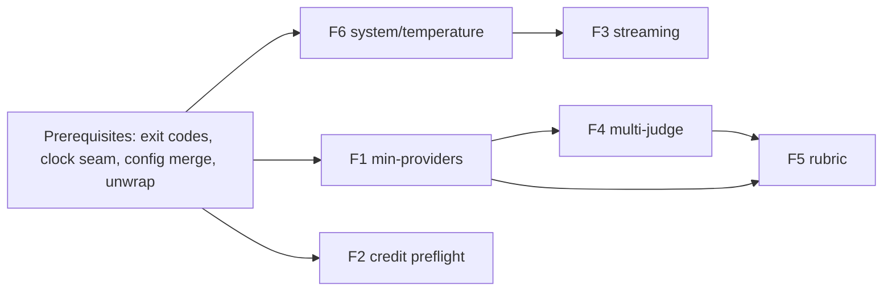

# Plan: reliability and judge-quality features

> Six decided features, planned not built. Branch `lane/plan-reliability-judging`,
> 2026-09-08, rebased on `main` at `774ecfe`, which already contains the OpenRouter
> slash-routing work (ADR-010, commits `ae4dd7e`..`774ecfe`). File and line references
> below are to that `main`. Revised after an adversarial review and live probes.

## Goals

Make a Conclave run trustworthy when part of the panel fails, cheap to abort when a
key is dead, pleasant to watch for one provider, and rigorous enough as a judge that
Praxis (the main caller, `X:\Forge\Praxis\.claude\skills\praxis-grade\scripts\grade.py`)
can delete its own panel-health accounting, per-criterion majority, and prompt
plumbing. Every existing flag keeps its meaning; human, brief, quiet and raw output are
unchanged unless a new flag is passed; JSON gains only additive blocks.

## Non-goals

No new providers, no change to default models, no change to ADR-002's two-mode split,
no OpenRouter routing beyond ADR-010, and no xAI-specific work Praxis would depend on
(grok is excluded from Praxis by operator preference). Praxis itself is not modified.
Batch mode gets each feature threaded through with the smallest behaviour that keeps
the JSONL contract; it is not redesigned.

## How the caller uses Conclave today

Praxis runs one call per question: `conclave gemini,openai "<instruction>" --no-judge
--json --general --timeout 180` with the evaluator prompt on stdin. Claude's vote goes
around Conclave through `claude -p` on the Max plan (the Anthropic key has no credit).
Praxis then parses each provider's JSON with a tolerant extractor, computes a
per-criterion majority (expected ties resolve to `fail`, red-flag ties to
`indeterminate`, never `triggered`), records `panel: {requested, responded, degraded,
errors}` per question with `degraded = responded < requested`, and exits 3 on any
degraded question. It relies on Conclave printing the JSON envelope even on exit 1.
Two facts shape features 4 and 5: Praxis's "judges" are Conclave's *providers*, and one
panel member lives outside Conclave's process.

## Prerequisites (Phase A, step 0; about 6 h)

Small seams every feature below assumes. None changes behaviour on its own.

- **Typed exit codes.** `Execute` does `os.Exit(1)` on any error (`cmd/root.go:161`).
  Add `ExitError{Code int}` mapped with `errors.As`, and `SilenceUsage` so a degraded
  run does not print cobra usage to stderr.
- **Deterministic goldens.** JSON carries `time.Now()` and every format carries
  durations, so "byte-identical" tests need `output.Options.Now func() time.Time` plus
  duration normalisation in the harness. The goldens promised below use that seam.
- **Config to flag merge.** `TimeoutSeconds`, `DefaultJudge` and `DefaultProviders` are
  loaded and never read; flag defaults are hard-coded. Add a merge step (a flag wins
  when `cmd.Flags().Changed`, else config, else default) and `viper.SetDefault` per key
  so `CONCLAVE_*` env overrides actually resolve. New keys ride this path.
- **Optional-interface unwrap.** `modelOverrideProvider` hides embedded interfaces;
  `unwrapPreflighter` exists for one case. Replace with a generic `unwrap[T]` used by
  `Preflighter`, `Streamer` and `OptionsQuerier`.
- **Key rotator introspection.** `KeyRotator.Next()` round-robins, so a preflight that
  calls `getAPIKey()` checks an arbitrary key and advances the counter. Add `All()`.

---

## Feature 1: partial-panel success (`--min-providers N`)

**Surface.** `--min-providers N` (default 1, today's rule: proceed on any success).
`--fail-degraded` makes a degraded-but-quorate run exit 3. Config `min_providers`,
`fail_degraded`. Under `--all` the panel size is dynamic, so N is clamped to the
available count with a stderr warning rather than erroring.

**Definitions.** `degraded = succeeded < requested`, always, matching Praxis. Quorum
(`succeeded >= min`) decides only the exit code and whether the judge runs.

```json
"panel": {"requested": 3, "succeeded": 2, "min": 1, "degraded": true,
          "failed": [{"provider": "gemini", "error": "HTTP 400: User location is not supported"}]}
```

Human and verbose: header row `Panel: 2/3 responded (degraded)` plus the existing
per-provider error boxes. Brief: ` [panel 2/3]` suffix only when degraded. Quiet:
unchanged (it is used in `$(...)` substitutions). Raw: the first line stays
`===PROVIDER:` and `===END===` stays; one trailing line
`===PANEL requested=3 succeeded=2 degraded=true===` follows `===END===` only when
degraded, so parsers that stop at `===END===` are unaffected.

**Exit codes.** 0 full or quorate; 1 below quorum or all failed (envelope still
printed, as today); 3 quorate-but-degraded only under `--fail-degraded`. Distinct from
1 so a caller can tell "the answer is bad" from "the measurement is untrustworthy".

**Design.** `orchestrator.Run` returns a `Panel` alongside responses and takes
`MinProviders`; "all providers failed" becomes a typed `ErrBelowQuorum`. `output.Result`
gains `Panel`; `renderJSON` adds the block unconditionally (additive, `version` stays
`1.0`). The judge prompt is unchanged: failed providers keep their `[Error: ...]` block
and their blind-mode letter (`prompt.go` labels by index), so verdicts and labels on
partial panels are not silently altered. Dropping error blocks would be a separate,
ADR-worthy prompt change.

**Files.** `internal/orchestrator/orchestrator.go`, `internal/output/{output,render}.go`
(`templates.go` and `templates/*.md` have no callers and are left alone), `cmd/root.go`,
`internal/batch/processor.go`.

**Batch.** Each item gets `panel`. A below-quorum run counts as a query error for the
existing `--retries` loop; a quorate degraded run is written, never retried.

**Tests.** `panel-quorum-below-min.test` (2/4 with min 3 exits 1, envelope printed),
`panel-degraded-flag-in-every-format.test` (quiet asserted unchanged),
`panel-full-success-unchanged.test` (golden with the clock seam: 3/3 output identical
apart from the additive JSON block), `panel-raw-trailer-after-end.test`,
`panel-fail-degraded-exit-3.test`, `panel-all-clamps-min.test`.

**Docs/ADR.** New ADR (quorum contract). README flag table; AGENTS gotcha 2 gains a
line on quorum. Effort: 6 h.

## Feature 2: credit-aware preflight (API mode)

**Surface.** No new flag; `--skip-preflight` still bypasses. Config
`preflight.credit: true`. Failures print the existing remediation block plus a reason:
`invalid_key`, `no_credit`, `forbidden`.

**What each vendor exposes** (docs fetched 2026-09-08; invalid-key rows probed live
with bogus keys, balance fields probed live with Keeper keys):

| Vendor | Cheapest call | Reveals | Not revealed |
|---|---|---|---|
| Anthropic | `GET /v1/models` (`x-api-key`, `anthropic-version`) | bad key: 401 `authentication_error` (probed); 402 `billing_error`, 403 `permission_error` per the general error docs, not confirmed on this endpoint | credit balance; "credit balance too low" is a 400 only on `/v1/messages` |
| OpenAI | `GET /v1/models` (Bearer) | bad key: 401 `invalid_request_error`, code `invalid_api_key` (probed) | quota; `credit_balance_exhausted` / `insufficient_quota` arrive as 429 on completions only |
| Gemini | `GET /v1beta/models?key=` or `x-goog-api-key` | bad key: **400** `INVALID_ARGUMENT` "API key not valid" (probed; the docs say 401), 403 `permission_denied` | quota (429 `quota_exceeded`, 400 `failed_precondition` billing/location only on generate) |
| OpenRouter | `GET /api/v1/key` (Bearer; `/auth/key` is an undocumented alias that also answers, probed) | `limit`, `limit_remaining` (null = unlimited), `usage`, `is_free_tier`, `expires_at`; bad key: 401 | `GET /api/v1/credits` (`total_credits`, `total_usage`) is documented as management-key only but answered a plain key live; optional second call |
| xAI | `GET /v1/api-key` (Bearer; probed, absent from fetchable docs) | `api_key_blocked`, `api_key_disabled`, `team_blocked`, `acls`; bad key: **400 with a plain-text body** "Incorrect API key provided" (probed) | balance; `/v1/models` and `/v1/language-models` exist as fallbacks |

**Mapping to outcomes.** `ok`: 2xx. `fail`: 401 or 403 anywhere; Gemini 400 whose
message contains "API key"; xAI 400 whose raw body mentions "API key" (not JSON, so
check before `parseAPIError`); OpenRouter `limit_remaining <= 0`, or
`total_credits - total_usage <= 0` when `/credits` answers; xAI `api_key_blocked`,
`api_key_disabled` or `team_blocked`. `unknown`: timeout, 5xx, 429, transport error,
any other 400, `/credits` refusing the key. Only `fail` stops the run; `unknown`
proceeds. A wrong mapping is the expensive failure: an `unknown` bad key costs one
failed paid call per provider per question, so the bogus-key probes become fixtures.

**Design.** `Preflight` returns a typed `*PreflightError{Reason, Indeterminate}`;
`RunPreflight` drops indeterminate results and carries `Reason` into
`PreflightResult`. `apiBaseProvider.preflightGET(ctx, url, headers)` has no retries
(retries would eat the shared 5 s budget). Every key in the rotator is checked within
that budget, in parallel. Remediation becomes mode-aware: API-mode `claude` says "set
`ANTHROPIC_API_KEY`", not `claude auth login`. **The landed OpenRouter preflight
changes**: it uses `doRequest` (retries 429/5xx, fails on any non-2xx) and `/auth/key`;
feature 2 moves it onto `preflightGET` and `/api/v1/key` with the mapping above, and
updates `api_openrouter_test.go` (path pin, 402 case) and `cmd/init.go`'s openrouter
branch, which today reuses that Preflight with a 15 s context.

**Files.** `internal/providers/{provider.go,preflight.go,api_base.go,api_anthropic.go,
api_openai.go,api_gemini.go,api_grok.go,api_perplexity.go,api_openrouter.go,
api_openrouter_test.go}`, `cmd/init.go`.

**Edge cases.** Corporate proxies that 403 the models endpoint: `forbidden` fails;
document `--skip-preflight`. Gemini location blocks are invisible here; feature 1
surfaces them. Batch mode preflights once, as today.

**Tests.** `preflight-no-credit-blocks-run.test` (httptest OpenRouter,
`limit_remaining: 0`), `preflight-unknown-never-gates.test` (5xx, 429, slow server),
`preflight-invalid-key-reason.test` (one fixture per vendor: Anthropic 401 JSON, OpenAI
401 `invalid_api_key`, Gemini 400 `INVALID_ARGUMENT`, xAI 400 plain text, OpenRouter
401), `preflight-budget-5s-shared.test`, `preflight-all-rotator-keys-checked.test`.

**Docs/ADR.** Extends ADR-004 consequences; no new ADR. README "Preflight" subsection.
Effort: 7 h.

## Feature 3: streaming

**Surface.** `--stream` (opt-in in v1; config `stream: off|on|auto`, `auto` = exactly
one provider, no judge, both stdout and stderr are TTYs, matching the TUI's stderr
gate). Never active under `--json`, `--raw`, `--quiet`, `--brief`, or batch; those paths
never call the streaming method, so their bytes are identical by construction.
`--stream` with more than one provider or with a judge is ignored with one warning.

**Providers.** New optional interface, detected through `unwrap[Streamer]`:

```go
type Streamer interface {
    QueryStream(ctx context.Context, prompt, model string, opts QueryOptions,
                onDelta func(text string)) (string, time.Duration, *Metrics, error)
}
```

`api_base.go` gains `doStreamRequest` (SSE reader: `data:` frames, `[DONE]`), a sibling
of `doRequest` sharing its retry helper; retries apply only before the first delta,
after which the error is surfaced with the partial text kept. OpenAI-compatible
providers send `stream: true` and `stream_options: {"include_usage": true}`. Probed
live: xAI sends usage in a trailing chunk with empty `choices`; the GLM Coding Plan
sends it on the final `finish_reason: "stop"` chunk. The parser accepts both and treats
missing usage as nil metrics (Perplexity unprobed, no key on this machine). Anthropic:
`stream: true`, `content_block_delta.text_delta`, usage from `message_delta`. Gemini:
`:streamGenerateContent?alt=sse`.

CLI mode: claude `--output-format stream-json --include-partial-messages --verbose`
(without `--verbose` the CLI refuses; deltas arrive as `stream_event` /
`content_block_delta`, probed); gemini `-o stream-json`; grok `-p --output-format
streaming-json`. codex `--json` emits only `thread.started`, `turn.started`,
`item.completed`, `turn.completed` (probed: the message arrives whole), so codex stays
non-streaming. Providers without `Streamer` fall back to `Query`.

**TUI.** In stream mode the Bubble Tea program is not started; a one-line stderr
header, deltas on stdout, then the styled footer. Optional later: per-provider live
preview in the multi-provider TUI via a throttled `ProviderDeltaMsg` (10 Hz, last line
only), never touching stdout.

**Files.** `internal/providers/{provider.go,api_base.go,api_*.go,claude.go,gemini.go,
grok.go}`, `internal/tui/*`, `cmd/root.go`, `internal/output` (footer-only path).

**Tests.** `stream-json-byte-identical.test` (same fake provider, `--json` equal with
and without `--stream`), `stream-sse-parser-split-frames.test`,
`stream-usage-both-chunk-shapes.test`, `stream-fallback-non-streamer.test`,
`stream-error-after-first-delta-keeps-text.test`, `stream-never-under-raw.test`.

**Docs/ADR.** No ADR; the invariant lives as a guard comment in `cmd/root.go` and the
golden test. README section. Effort: 10 h (API), 4 h (CLI), 4 h (TUI, optional).

## Feature 4: multi-judge panels (`--judge claude,openai,gemini`)

**Surface.** `--judge` accepts a comma list; with one name every existing field is
unchanged and the new blocks are additive. `--min-judges N` (default 1). Config
`min_judges`. Output adds:

```json
"execution": {"providers": ["gemini","openai","claude"], "judge": "claude", "judges": ["claude","openai","gemini"], "timeout_seconds": 60},
"verdict": {"result": "UNSAFE", "confidence": "high", "reasoning": "...", "agreements": [], "disagreements": [], "recommendations": []},
"judges": [
  {"provider": "claude", "model": "claude-opus-5", "status": "success", "verdict": {"result": "UNSAFE", "confidence": "high", "reasoning": "..."}},
  {"provider": "openai", "model": "gpt-5.6-sol", "status": "success", "verdict": {"result": "UNSAFE", "confidence": "medium", "reasoning": "..."}},
  {"provider": "gemini", "model": "gemini-3.1-pro-preview", "status": "error", "error": "HTTP 429 ..."}
],
"agreement": {"metric": "verdict_string", "score": 1.0, "majority": "UNSAFE", "votes": {"UNSAFE": 2}, "succeeded": 2, "requested": 3, "min": 1, "degraded": true}
```

`execution.judge` stays a string (the first judge, as today); `execution.judges` is
new. `meta.judge_duration_ms` becomes the slowest judge. With several judges `verdict`
is the majority verdict: `result` is the plurality of normalised result strings
(upper-case, trimmed, trailing punctuation stripped), or `SPLIT` on a tie;
`confidence` is the lowest among the majority; reasoning and lists come from the first
majority judge in `--judge` order. `agreement.degraded = succeeded < requested`.

**Agreement metric.** Chosen: verdict-string agreement, `score = majority votes /
succeeded judges`. Explainable, matches Praxis, and does not trust self-reported
confidence. Recorded alternative: confidence-weighted (high 1.0, medium 0.6, low 0.3),
rejected because self-reported confidence is uncalibrated across vendors and would let
one "high" judge outvote two "medium" ones. Known limit: free-form verdict strings
("YES" vs "YES, with caveats") split the vote; the rubric mode of feature 5 is the
fix, and the free-form prompt is not changed here.

**Resolution and preflight.** `main` already resolves and preflights the single judge
before the panel and refuses a slash-routed judge missing from the catalog
(`cmd/root.go:301-330`, AGENTS gotcha 9). With N judges all are resolved and preflighted
first; any refusal aborts before the panel spends anything. `withJudge` dedupes each.

**Blind mode.** One anonymised prompt is built once and sent to every judge, so labels
are identical across judges. A judge that is also a panel member is allowed as today.

**Failure interaction.** Judge failures are not panel failures. Below `--min-judges`
the run follows the feature 1 exit policy. A judge `PARSE_ERROR` is excluded from the
vote and keeps `judges[i].raw`. Degenerate cases: zero successful judges omits
`verdict`, sets `agreement.succeeded: 0`, and renders provider responses exactly as
the `PARSE_ERROR` path does today; `SPLIT` also shows responses. Today a judge error
is swallowed (recorded only in the spinner, no verdict, exit 0); the `judges` block
makes it visible in the single-judge case too, with no other change.

**Files.** `internal/judge/{judge.go,panel.go (new),prompt.go}`, `internal/output/*`,
`internal/tui` (synthesis line shows `2/3 judges`), `cmd/root.go`,
`internal/batch/processor.go`.

**Batch.** `batch.Options.JudgeName` becomes `JudgeNames []string` (today a comma list
would reach `GetProvider` and fail construction). Per item the majority verdict fills
`verdict`, judges appear under `--verbose`, and an item errors only when every judge
fails, as a single judge error does today.

**Tests.** `judge-quorum-below-min.test`, `judge-majority-tie-is-split.test`,
`judge-single-name-existing-fields-unchanged.test` (golden), `judge-blind-labels-shared.test`,
`judge-parse-error-keeps-raw.test`, `judge-all-fail-omits-verdict.test`,
`judge-slash-judge-catalog-miss-aborts-all.test`, `judge-batch-comma-list.test`.

**Docs/ADR.** New ADR (aggregation rule); ADR-001 gets a `related` link. Effort: 11 h.

## Feature 5: rubric-driven judging (`--rubric file.md`)

**Surface.** `--rubric path.md` adds a `scores` block; `--rubric-only` (judge mode)
skips the free-form verdict prompt; `--rubric-schema` prints the JSON Schema of the
score output and exits. `--rubric` is rejected with `--raw` and `--quiet` (neither can
carry `scores`). Config `rubric` (default path). Two modes:

- With a judge: each judge scores every successful provider response.
- With `--no-judge`: each *provider* scores the input against the rubric. This is
  Praxis's shape, and Conclave computes the per-criterion majority.

**Rubric file.** Markdown with YAML front matter; the body is free prose shown before
the criteria. Prompt order in `--no-judge` mode: rubric body, criteria block, context
(stdin and files), then the positional prompt as the task statement.

```markdown
---
name: concierge-response
scale: pass_fail            # pass_fail | 1-5 | 0-10
tie_expected: fail          # deadlocked expected criterion
tie_forbidden: indeterminate # deadlocked red flag; "triggered" is rejected at load
criteria:
  - id: recommends_park
    type: expected          # expected | forbidden | scored
    weight: 1
    text: Recommends at least one park
  - id: invents_park
    type: forbidden
    text: Names a park that does not exist
---
You are a strict evaluator. Default to fail when uncertain.
```

**Output schema.** One entry per *target*, each with per-scorer rows and an aggregate.
`--no-judge` has one target, `input`, scored by the providers; judge mode has one
target per successful provider response, scored by every judge.

```json
"scores": {
  "rubric": {"name": "concierge-response", "scale": "pass_fail", "criteria": 2},
  "targets": [
    {"target": "input",
     "by_scorer": [
       {"scorer": "gemini", "status": "success", "criteria": [
         {"id": "recommends_park", "verdict": "pass", "score": 1, "rationale": "..."},
         {"id": "invents_park", "verdict": "clean", "score": 1, "rationale": "..."}],
        "overall": 1.0, "rationale": "..."},
       {"scorer": "claude", "status": "success", "criteria": [
         {"id": "recommends_park", "verdict": "pass", "score": 1, "rationale": "..."},
         {"id": "invents_park", "verdict": "triggered", "score": 0, "rationale": "..."}],
        "overall": 0.5, "rationale": "..."},
       {"scorer": "openai", "status": "parse_error", "raw": "..."}
     ],
     "aggregate": {"criteria": [
         {"id": "recommends_park", "verdict": "pass", "votes": {"pass": 2}, "n_votes": 2, "tie": false},
         {"id": "invents_park", "verdict": "indeterminate", "votes": {"clean": 1, "triggered": 1}, "n_votes": 2, "tie": true}],
       "overall": 1.0, "scorers_succeeded": 2, "scorers_requested": 3, "degraded": true}}
  ]
}
```

Verdicts: `pass|fail` (expected), `clean|triggered` (forbidden), numeric `score`
(scored). A criterion a scorer omitted is `missing`, not a fail. `overall` is the
weighted mean of decided criteria (pass/clean = 1, fail/triggered = 0, scored values
normalised to the scale); `indeterminate` and `missing` are excluded, so the example
aggregate is 1.0 over its one decided criterion. Ties resolve per type as above.

**Prompt construction.** `internal/judge/prompt.go` gets a second template rendering
the criteria as numbered blocks with stable ids and demanding strict JSON with those
ids. Multi-judge composes naturally: each judge is one `by_scorer` row under every
target and `aggregate` is computed once per target. In judge mode the free-form
`verdict` is still produced unless `--rubric-only`, so `--rubric` adds a block and
changes nothing else.

**Validation and parse failure.** Extraction reuses `parseVerdict`'s three-stage JSON
recovery; validation is a typed struct plus id and enum checks (no schema library,
matching the repo's dependency-light stance; `--rubric-schema` still emits a formal
JSON Schema). A scorer that fails validation is `parse_error` with `raw` preserved and
is excluded from votes. Provider responses always remain in `responses`.

**Files.** `internal/rubric/{rubric.go,schema.go,aggregate.go}` (new), `internal/judge/
prompt.go`, `internal/output/*`, `cmd/root.go`, `cmd/rubric.go`,
`internal/batch/processor.go`.

**Batch.** Batch has no `--no-judge` today (it always judges when there is more than
one provider), so `--no-judge --rubric --batch` needs `NoJudge` added to
`batch.Options`; that is the one batch behaviour this plan adds. Items carry `scores`.
Batch forces cheap models, so rubric scoring there runs on the cheap tier unless `-m`
pins otherwise; the docs say so.

**Tests.** `rubric-parse-error-keeps-provider-output.test`,
`rubric-forbidden-tie-is-indeterminate.test`, `rubric-expected-tie-is-fail.test`,
`rubric-tie-forbidden-triggered-rejected.test`, `rubric-missing-criterion-not-fail.test`,
`rubric-front-matter-invalid-exits-1.test`, `rubric-no-judge-scores-input.test`,
`rubric-judge-mode-one-target-per-response.test`, `rubric-raw-quiet-rejected.test`,
`rubric-schema-matches-output.test`, `rubric-overall-excludes-undecided.test`.

**Docs/ADR.** New ADR (rubric contract). `docs/RUBRICS.md`. Effort: 16 h.

## Feature 6: `--system`, `--temperature`, `--max-tokens`

**Surface.** `--system TEXT` or `--system @file`, `--temperature F`, `--max-tokens N`.
Applied to panel providers only; the judge keeps Conclave's own prompt. Config
`system`, `temperature`, `max_tokens`. Precedence for OpenAI budgets: `--max-tokens`,
then `CONCLAVE_OPENAI_MAX_COMPLETION_TOKENS`, then the compiled default. Unsupported
combinations warn once on stderr and appear in `meta.warnings[]`; never a failure.

**Design.** `QueryOptions{System string; Temperature *float64; MaxTokens *int}`. New
optional interface `OptionsQuerier{QueryWithOptions(ctx, prompt, model, opts)}` found
through `unwrap`; the fallback calls `Query` and reports which options were dropped.
Streaming takes the same struct.

**Capability table.**

| Provider | Mode | System | Temperature | Max tokens |
|---|---|---|---|---|
| claude | API | `system` | Claude 5 family and Opus 4.7+ return 400 on any non-default value (docs, verified): drop and warn for those ids, send for older models | `max_tokens` (replaces the fixed 8192) |
| claude | CLI | `--append-system-prompt` or `--system-prompt` (open question 2) | no | no |
| openai | API | `system` role (`developer` for gpt-5.x) | gpt-5.x reject values other than 1: drop and warn | `max_completion_tokens` for gpt-5.x, else `max_tokens` |
| openai (codex) | CLI | `-c developer_instructions=<TOML string>` (verified key; long prompts via `model_instructions_file` in a temp file) | no key exists (verified) | no |
| gemini | API | `systemInstruction` | `generationConfig.temperature` | `maxOutputTokens` |
| gemini | CLI | `GEMINI_SYSTEM_MD=<temp file>` (verified in the installed docs; replaces the CLI's whole prompt, open question 6) | no | no |
| grok | API | `system` role | yes | `max_tokens` |
| grok | CLI | `--rules` (append) or `--system-prompt-override` (replace), both in `--help` | no | no |
| perplexity | API | `system` role | yes | `max_tokens` |
| perplexity | CLI | unknown (binary absent here); warn until probed | unknown | unknown |
| glm | CLI (HTTP) | `system` role | yes | `max_tokens` |
| vendor/model (OpenRouter) | API | `system` role | pass-through | `max_tokens` |

**Files.** `internal/providers/*` (every provider), `internal/config/config.go`,
`cmd/root.go`, `internal/batch/processor.go`, `internal/output` (warnings).

**Tests.** `options-unsupported-warns-once-not-fail.test`,
`options-gpt5-temperature-dropped.test`, `options-claude5-temperature-dropped.test`,
`options-system-file-read.test`, `options-absent-request-body-byte-identical.test`
(httptest asserts today's bodies when no flag is set), `options-judge-not-affected.test`,
`options-max-tokens-beats-env.test`.

**Docs/ADR.** New ADR (best-effort options). README flag table; MODEL_REGISTRY note on
sampling restrictions. Effort: 9 h.

---

## Cross-cutting

**Backward compatibility.** Defaults reproduce current behaviour: `min_providers 1`,
no `--fail-degraded`, single judge, no rubric, no options, streaming off. JSON gains
`panel`, `execution.judges`, `judges`, `agreement`, `scores`, `meta.warnings`; nothing
is renamed or removed and `version` stays `1.0`. Raw output changes only in the
degraded case, after `===END===`. Goldens with the clock seam pin the healthy 3/3
single-judge path in every format.

**config.yaml keys.** `min_providers`, `fail_degraded`, `min_judges`, `stream`,
`preflight.credit`, `system`, `temperature`, `max_tokens`, `rubric`. All registered
with `SetDefault` so `CONCLAVE_*` overrides resolve (ADR-005), via the prerequisite
merge step.

**Composition.** `--min-providers 2 --judge claude,openai --rubric r.md`: the panel
runs, quorum is checked, both judges score every successful response against the
rubric, `scores.targets[*].aggregate` is the per-criterion majority across judges,
`agreement` reports judge concordance, and `degraded` can be true on the panel, the
judges, or both, each in its own block. `--no-judge --rubric` skips judges and
aggregates across providers instead.

**Phasing.**



Phase A: prerequisites, then F1 and F6 (both touch every provider and the output
package; F1 first to limit merge churn). Phase B: F2 and F3. Phase C: F4. Phase D: F5.
Roughly 70 h, 74 h with the optional TUI preview.

## Proposed ADRs (not written here)

- ADR-011 Partial-panel quorum: a run proceeds at `min_providers` successes,
  `degraded` means any failure, and exit 3 is opt-in.
- ADR-012 Judge panels aggregate by verdict-string majority (ties are `SPLIT`), not by
  self-reported confidence.
- ADR-013 Rubric contract: YAML-front-matter markdown in, fixed `scores` schema out;
  parse failures keep raw output; ties resolve per criterion type and a red-flag tie
  can never be `triggered`.
- ADR-014 Request options are best-effort per provider: unsupported `system`,
  `temperature`, or `max_tokens` warn once and never fail the run.

## Open questions for the operator

1. Degraded exit code: keep 0 by default with `--fail-degraded`, or make 3 the default
   to match Praxis?
2. `--system` on the claude CLI: `--append-system-prompt` (keeps Claude Code's prompt)
   or `--system-prompt` (replaces it)? Both exist; this is a choice.
3. Mixed transport in one panel (Max-plan `claude` via CLI beside `-g` API providers,
   e.g. `claude@cli`) so Praxis can drop its roost routing: schedule as a seventh item?
4. Streaming default: opt-in `--stream`, or `auto` on a TTY from day one?
5. Rubric v1 scale: pass/fail only, or numeric `1-5` and `0-10` too?
6. Gemini CLI system prompt: `GEMINI_SYSTEM_MD` replaces the whole CLI prompt. Use it
   with a warning, or treat gemini CLI as unsupported for `--system`?

## What Praxis can delete

| Feature | Praxis code retired | Condition |
|---|---|---|
| F1 | The `provider missing from conclave output` fallback in `_gather_panel_verdicts`; per-question `panel` counting for Conclave-routed providers moves to `panel.failed` | Fully only once question 3 brings claude inside Conclave |
| F2 | Nothing directly; the 2026-08-06 location 400 is invisible to preflight. Dead keys fail before the first question instead of thirteen times | none |
| F3 | Nothing; Praxis is non-interactive | none |
| F4 | `_majority` at verdict level and its tie bookkeeping | With F5, and question 3 |
| F5 | `_JUDGE_INSTRUCTION` and `_build_judge_prompt` (become a rubric file), `_extract_json` per provider, per-criterion `_majority` with `INDETERMINATE`, `expected_majority` / `forbidden_majority` assembly | `--no-judge --rubric` mode; question 3 for the claude vote |
| F6 | `_CONCLAVE_QUERY` instruction string (moves to `--system`); temperature pinning for determinism, which Praxis cannot do today | none |

Maintenance rule: update the phasing when a feature lands, and delete this plan once
ADR-011 to ADR-014 exist and the features ship.
